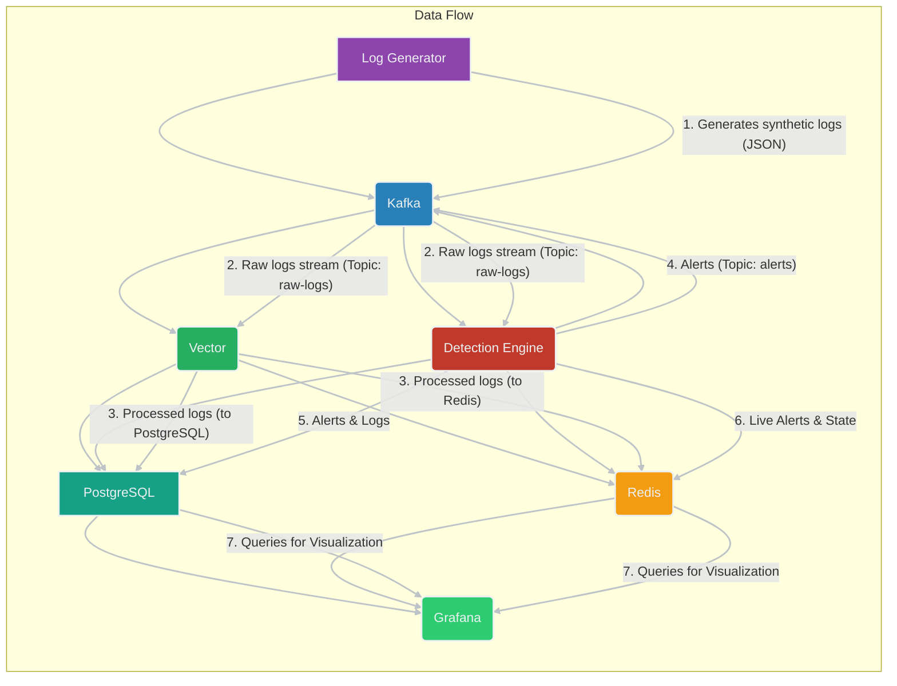

# SimuloSIEM

**Tech Stack:**
- **Containerization:** Docker, Docker Compose
- **Message Broker:** Apache Kafka, Apache Zookeeper
- **Log Processing & Routing:** Vector
- **Database:** PostgreSQL
- **In-memory Data Store:** Redis
- **Detection Engine:** Python (kafka-python, redis, psycopg2-binary)
- **Log Generation:** Python (kafka-python)
- **Visualization & Monitoring:** Grafana

## 1. Project Overview

SimuloSIEM is a comprehensive, containerized Security Information and Event Management (SIEM) system designed for simulating and demonstrating real-time log collection, processing, anomaly detection, and visualization. It provides a hands-on environment to understand the fundamental components and workflows of a modern SIEM solution, from log generation to alert presentation.

**Core Functionalities:**
-   **Synthetic Log Generation:** A dedicated Python service (`log-generator`) continuously produces realistic security-related logs (e.g., login attempts, sudo commands, file access, network scans) to simulate diverse network activity. This allows for testing and demonstration without relying on live production data.
-   **High-Throughput Log Ingestion:** Apache Kafka serves as the central message broker, enabling efficient and scalable ingestion of high volumes of raw log data from the log generator. Kafka's distributed nature ensures fault tolerance and high availability for the log stream.
-   **Flexible Log Processing and Routing:** Vector, a high-performance observability data router, consumes raw logs from Kafka. It is configured to parse, transform, and enrich these logs before routing them to various destinations, ensuring data is in the correct format for subsequent analysis and storage.
-   **Persistent Log Storage:** All processed log data is reliably stored in a PostgreSQL relational database. This provides a robust and queryable repository for historical analysis, auditing, and compliance purposes.
-   **Real-time Anomaly Detection:** A custom Python-based Detection Engine continuously monitors the incoming log stream from Kafka. It applies predefined security rules (e.g., brute-force detection, privilege escalation) to identify suspicious activities and potential threats in real-time.
-   **Ephemeral Alert Management:** Redis, an in-memory data store, is utilized by the Detection Engine to manage ephemeral state (e.g., tracking failed login attempts for a short duration) and to store real-time alerts. This allows for rapid retrieval and display of active alerts in live dashboards.
-   **Historical Alert Persistence:** In addition to ephemeral storage, all detected security alerts are also persisted in the PostgreSQL database. This ensures a complete historical record of all security incidents for long-term analysis, trend identification, and post-incident investigations.
-   **Interactive Data Visualization:** Grafana is integrated to provide powerful and intuitive dashboards. These dashboards offer real-time and historical views of logs and alerts, enabling security analysts to visualize trends, identify top alerted entities (IPs, users), and drill down into raw log data for deeper insights.
-   **Containerized Deployment:** The entire SimuloSIEM ecosystem is containerized using Docker and orchestrated with Docker Compose. This simplifies setup, ensures environment consistency, and provides portability across different development and testing environments.

This project serves as an excellent educational tool for understanding the intricate workings of a SIEM system, from data flow and component interaction to threat detection methodologies.

## 2. System Architecture

SimuloSIEM's architecture is designed for scalability and modularity, mimicking a typical SIEM deployment. Logs flow through a pipeline of specialized services, each handling a specific aspect of the SIEM process. The system is built around a central message bus (Kafka) that facilitates asynchronous and decoupled communication between components.



**Detailed Architectural Flow:**

1.  **Log Generation (`log-generator`):**
    *   The `log_generator/generate_logs.py` Python script acts as the initial data source. It simulates various security events (e.g., `login_success`, `login_fail`, `sudo`, `file_access`) by randomly selecting users, IP addresses, event types, and services.
    *   Each generated log entry is formatted as a JSON object, ensuring structured data for downstream processing.
    *   These JSON logs are then published to the `raw-logs` topic within the Kafka message broker.

2.  **Kafka Message Broker (`kafka` & `zookeeper`):**
    *   **Kafka:** Serves as the central, high-throughput, and fault-tolerant backbone for log and alert streams. It decouples the producers (Log Generator, Detection Engine) from the consumers (Vector, Detection Engine), allowing for independent scaling and resilience.
    *   **Why Kafka over RabbitMQ?** Kafka is fundamentally designed as a distributed streaming platform, optimized for high-throughput, low-latency ingestion and processing of event streams. Its architecture, based on partitioned, append-only logs, makes it ideal for log aggregation and real-time analytics where message order within a partition and durability are critical. RabbitMQ, while a robust message broker, is traditionally more suited for general-purpose message queuing with complex routing logic and guaranteed message delivery to individual consumers. For a SIEM, where the primary concern is processing a continuous, high-volume stream of immutable log data that multiple consumers might need to read independently (e.g., Vector for persistence, Detection Engine for analysis), Kafka's publish-subscribe model with consumer groups and persistent storage offers superior performance, scalability, and data replayability.
    *   **Zookeeper:** Provides essential coordination services for Kafka, managing broker metadata, topic configurations, and consumer offsets.
    *   The `raw-logs` topic receives all incoming synthetic log data.
    *   The `alerts` topic is used by the Detection Engine to publish detected security incidents.

3.  **Log Processing and Routing (`vector`):**
    *   Vector continuously subscribes to and consumes messages from the `raw-logs` Kafka topic.
    *   Upon receiving a log, Vector applies a `remap` transformation (defined in `vector/vector.yaml`). This step is crucial for parsing the raw JSON string into structured fields, converting data types (e.g., timestamp strings to actual timestamps), and ensuring data quality.
    *   **Why Vector over Logstash?** Vector was chosen for its modern architecture, superior performance, and significantly lower resource consumption compared to Logstash. Logstash, part of the ELK stack, is a powerful data processing pipeline but can be resource-intensive due to its JVM-based nature. Vector, written in Rust, offers a lightweight, high-performance alternative specifically designed for observability data (logs, metrics, traces). It provides a unified agent for collecting, transforming, and routing data with a focus on efficiency and reliability, making it a more suitable choice for a high-volume log processing pipeline in a resource-conscious environment.
    *   After transformation, Vector routes the processed logs to two distinct destinations:
        *   **PostgreSQL (`logs` table):** All processed logs are inserted into the `logs` table in the PostgreSQL database for long-term archival and historical querying.
        *   **Redis (Ephemeral Log Storage):** A subset of logs (or specific log types, depending on configuration) can be stored in Redis with a defined key structure (e.g., `log:{{ip}}:{{timestamp}}`). While not the primary historical store, this demonstrates Redis's capability for fast, ephemeral data access.

4.  **Real-time Detection (`detection-engine`):**
    *   The `detection_engine/main.py` Python application also subscribes to and consumes messages from the `raw-logs` Kafka topic, operating in parallel with Vector.
    *   For each incoming log, the Detection Engine iterates through a set of predefined security rules (e.g., `brute_force.py`, `sudo_after_fail.py`).
    *   These rules leverage Redis to maintain state across log events. For instance, the brute-force rule increments a counter in Redis for failed login attempts from a specific IP, expiring after a set time. The `sudo_after_fail` rule checks for the existence of a flag in Redis indicating a recent failed login for a user.
    *   If a rule identifies a suspicious pattern, it generates a structured alert object.

5.  **Alert Handling and Persistence:**
    *   When an alert is generated:
        *   It is immediately stored in Redis with a short Time-To-Live (TTL), making it available for real-time dashboards or other services requiring immediate access to active alerts.
        *   It is published to the `alerts` Kafka topic, allowing other services to react to or consume alert data.
        *   It is persistently stored in the `alerts` table within the PostgreSQL database, ensuring a complete historical record of all security incidents for compliance, post-incident analysis, and long-term trend analysis.

6.  **Data Visualization (`grafana`):**
    *   Grafana connects directly to the PostgreSQL database as its primary data source (configured via `grafana/provisioning/datasources/datasource.yaml`).
    *   Pre-built dashboards (defined in `grafana/provisioning/dashboards/alerts-dashboard.json`) query the `logs` and `alerts` tables in PostgreSQL.
    *   These dashboards provide visual representations of:
        *   **Alerts Over Time:** Trends and volume of different alert types.
        *   **Top Alerted IPs:** Identification of IP addresses generating the most alerts.
        *   **All Logs:** A tabular view of raw log data for detailed inspection.
    *   Grafana enables security analysts to monitor the system's health, identify potential threats, and gain insights from the collected data.

This architecture ensures a robust, scalable, and observable SIEM pipeline, demonstrating how various open-source tools can be integrated to achieve comprehensive security monitoring.

## 3. File-by-File Breakdown

-   **`docker-compose.yaml`**: The orchestration file for all services. It defines how each component (Kafka, Zookeeper, Redis, PostgreSQL, Vector, Detection Engine, Log Generator, Grafana) is built, configured, and linked. It also sets up port mappings, volume mounts, and health checks for robust startup.
-   **`detection_engine/`**:
    -   **`Dockerfile`**: Defines the Docker image for the Detection Engine, installing Python dependencies from `requirements.txt`.
    -   **`main.py`**: The core logic of the Detection Engine. It connects to Kafka to consume raw logs, applies detection rules, and then stores alerts in Redis (for live display), sends them back to Kafka (for other consumers), and persists them in PostgreSQL. It includes connection retry logic for robustness.
    -   **`requirements.txt`**: Lists Python dependencies for the Detection Engine: `kafka-python`, `redis`, `psycopg2-binary`.
    -   **`rules/`**: Contains individual Python files for detection rules.
        -   **`brute_force.py`**: Implements a rule to detect brute-force login attempts by tracking failed login counts per IP in Redis with an expiration.
        -   **`sudo_after_fail.py`**: Implements a rule to detect suspicious privilege escalation (sudo command after a failed login) by checking for a flag in Redis.
-   **`grafana/`**:
    -   **`provisioning/`**: Directory for Grafana's provisioning configuration.
        -   **`dashboards/`**:
            -   **`alerts-dashboard.json`**: A pre-configured Grafana dashboard JSON definition. It includes panels for "Alerts Over Time" (timeseries from PostgreSQL), "Top 5 Alerted IPs" (barchart from PostgreSQL), and "All Logs" (table from PostgreSQL).
            -   **`dashboard-provider.yaml`**: Configures Grafana to load dashboards from the `dashboards` directory.
        -   **`datasources/`**:
            -   **`datasource.yaml`**: Configures PostgreSQL as a data source within Grafana, allowing it to query the `simulosiem` database.
-   **`log_generator/`**:
    -   **`Dockerfile`**: Defines the Docker image for the Log Generator, installing Python dependencies.
    -   **`generate_logs.py`**: A Python script that continuously generates synthetic security logs with varying event types, users, and IPs. It serializes these logs to JSON and sends them to the `raw-logs` Kafka topic.
    -   **`requirements.txt`**: Lists Python dependencies for the Log Generator: `kafka-python`.
-   **`postgres/`**:
    -   **`init.sql`**: SQL script executed automatically by the PostgreSQL container on first startup. It creates the `logs` table (for raw log storage) and the `alerts` table (for detected alerts) with appropriate schemas.
-   **`redis/`**: (Empty directory, but `docker-compose.yaml` uses the official `redis` image). Redis is used by the Detection Engine for ephemeral state management (e.g., tracking failed login attempts) and for storing live alerts.
-   **`vector/`**:
    -   **`vector.yaml`**: The configuration file for Vector. It defines:
        -   A Kafka source (`raw-logs` topic).
        -   A `remap` transform to parse and format log fields (e.g., timestamp conversion, type casting).
        -   Two sinks: one for PostgreSQL (to persist logs to the `logs` table) and one for Redis (to store logs with a specific key format, primarily for demonstration).

## 4. Database Schema

The PostgreSQL database (`simulosiem`) contains two primary tables:

### `logs` table

Stores all raw log entries ingested into the system.

| Column    | Type      | Description                               |
| :-------- | :-------- | :---------------------------------------- |
| `id`      | `INTEGER` | (Currently `NULL`, could be `SERIAL PRIMARY KEY` for auto-incrementing) |
| `timestamp` | `TIMESTAMP` | The timestamp of the log event.           |
| `user`    | `TEXT`    | The user associated with the event.       |
| `ip`      | `TEXT`    | The IP address associated with the event. |
| `event`   | `TEXT`    | The type of event (e.g., `login_success`, `sudo`). |
| `service` | `TEXT`    | The service involved in the event.        |

### `alerts` table

Stores details of detected security alerts.

| Column      | Type      | Description                               |
| :---------- | :-------- | :---------------------------------------- |
| `id`        | `SERIAL PRIMARY KEY` | Unique identifier for each alert.         |
| `alert_type` | `TEXT`    | The type of alert (e.g., `Brute Force Detected`). |
| `ip`        | `TEXT`    | The IP address involved in the alert.     |
| `user`      | `TEXT`    | The user involved in the alert.           |
| `count`     | `INTEGER` | (Optional) Count related to the alert, e.g., failed login attempts. |
| `timestamp` | `TIMESTAMP` | The timestamp when the alert was generated. |

## 5. API Communication

The system primarily uses Kafka as its central communication bus, acting as a high-throughput, fault-tolerant API for inter-service communication.

-   **Log Generator -> Kafka:** The `log_generator` service produces JSON-formatted log messages to the `raw-logs` Kafka topic. This is the primary input API for the SIEM pipeline.
-   **Kafka -> Vector:** Vector consumes messages from the `raw-logs` Kafka topic. This is Vector's input API.
-   **Vector -> PostgreSQL:** Vector acts as a client to the PostgreSQL database, inserting processed log data into the `logs` table. This is a database API interaction.
-   **Vector -> Redis:** Vector also interacts with Redis, storing log data using Redis commands (e.g., `SET`, `LPUSH`). This is a Redis API interaction.
-   **Kafka -> Detection Engine:** The `detection_engine` service consumes messages from the `raw-logs` Kafka topic. This is the Detection Engine's input API.
-   **Detection Engine -> Redis:** The Detection Engine uses Redis for state management (e.g., `INCR`, `EXPIRE`, `SETEX`, `EXISTS`) and for storing live alerts (`SET`, `EX`). This is a Redis API interaction.
-   **Detection Engine -> Kafka:** When an alert is detected, the `detection_engine` produces JSON-formatted alert messages to the `alerts` Kafka topic. This is an output API for the Detection Engine and an input API for any other service that might consume alerts.
-   **Detection Engine -> PostgreSQL:** The Detection Engine acts as a client to the PostgreSQL database, inserting detected alerts into the `alerts` table. This is another database API interaction.
-   **Grafana -> PostgreSQL:** Grafana queries the PostgreSQL database directly to retrieve historical log and alert data for visualization. This is a database API interaction.

## 6. Trade-offs and Considerations

-   **Simplicity vs. Production Readiness:** SimuloSIEM prioritizes clarity and ease of understanding for educational purposes. While it demonstrates core SIEM concepts, it's not designed for production-scale deployments without significant enhancements (e.g., Kafka replication, Vector scaling, robust error handling, security hardening).
-   **Synthetic Data:** The use of a synthetic log generator simplifies setup but means the system operates on idealized data. Real-world logs are far more complex and varied, requiring more sophisticated parsing and normalization.
-   **Rule-Based Detection:** The Detection Engine uses simple, rule-based detection. This is effective for known patterns but lacks the adaptability of machine learning-based anomaly detection for unknown threats.
-   **Ephemeral Redis Data:** Alerts stored in Redis have a short expiration. This is great for live dashboards but means Redis is not a source of truth for historical alerts. PostgreSQL serves that purpose.
-   **Resource Consumption:** Continuous log generation and processing can consume significant CPU, memory, and disk space over time, especially for Kafka and PostgreSQL.
-   **Monitoring:** While Grafana provides dashboards, comprehensive monitoring of the health and performance of individual services (e.g., Kafka consumer lag, Vector throughput) would require additional tools (e.g., Prometheus, Alertmanager).

## 7. Distributed Systems Concepts in Detail

SimuloSIEM exemplifies several key distributed systems concepts:

-   **Message Queues (Kafka):** Kafka acts as a central nervous system, decoupling producers (Log Generator, Detection Engine) from consumers (Vector, Detection Engine). This provides:
    -   **Asynchronous Communication:** Services don't need to be online simultaneously.
    -   **Scalability:** Easily add more producers or consumers without affecting others.
    -   **Durability:** Messages are persisted, preventing data loss even if consumers fail.
    -   **Load Balancing:** Multiple consumers can read from the same topic, distributing the workload.
-   **Data Pipelines (Vector):** Vector demonstrates a data pipeline pattern, where data flows through a series of processing stages (source -> transform -> sink). This allows for modular and flexible data routing and manipulation.
-   **State Management (Redis):** Redis is used for managing ephemeral state in a distributed environment. For example, the brute-force detection rule relies on Redis to maintain a shared, quickly accessible counter for failed login attempts across potentially multiple instances of the Detection Engine.
-   **Persistent Storage (PostgreSQL):** PostgreSQL provides reliable, durable storage for historical data, crucial for auditing, compliance, and long-term analysis in a distributed system.
-   **Service Discovery & Health Checks (Docker Compose):** Docker Compose's `depends_on` and `healthcheck` features are rudimentary forms of service discovery and health monitoring, ensuring services start in the correct order and are healthy before dependent services begin.
-   **Idempotency:** While not explicitly enforced everywhere, the design encourages idempotent operations where possible (e.g., inserting logs into PostgreSQL). If a log is re-processed, it should ideally not cause duplicate or incorrect entries.

## 8. Uniqueness of Identifiers

-   **Log Entries:** Currently, the `logs` table in PostgreSQL does not have a unique identifier (`id` is `NULL`). In a production system, an auto-incrementing `SERIAL PRIMARY KEY` would be essential for uniquely identifying each log entry. The combination of `timestamp`, `user`, `ip`, `event`, and `service` might be unique enough for simulation, but not guaranteed.
-   **Alerts:** The `alerts` table correctly uses `id SERIAL PRIMARY KEY`, ensuring each detected alert has a unique, auto-incrementing identifier.
-   **Kafka Messages:** Kafka assigns unique offsets to each message within a partition, providing a unique identifier for messages within the Kafka topic itself.
-   **Redis Keys:** Redis keys are constructed to be unique for specific purposes (e.g., `fail:{ip}` for brute force, `failed:{user}@{ip}` for sudo after fail, `alert:{alert_type}:{ip}:{user}` for live alerts). This ensures that data for different entities or alert types doesn't collide.

## 9. System Flowchart

(Refer to the "System Architecture" diagram under section 2. System Architecture for a visual representation of the data flow.)

**Detailed Flow:**

1.  **Log Generation:** `log_generator/generate_logs.py` creates synthetic log events as JSON objects.
2.  **Kafka Ingestion:** The Log Generator sends these JSON logs to the `raw-logs` Kafka topic.
3.  **Parallel Consumption:**
    -   **Vector Consumption:** The `vector` service consumes logs from the `raw-logs` Kafka topic.
    -   **Detection Engine Consumption:** The `detection-engine` service also consumes logs from the `raw-logs` Kafka topic.
4.  **Vector Processing:**
    -   Vector applies a `remap` transform to parse and normalize the log data.
    -   Vector then routes the processed logs to two sinks:
        -   **PostgreSQL (logs table):** Logs are persistently stored in the `logs` table for historical analysis.
        -   **Redis (log:{{ip}}:{{timestamp}} key):** A subset of logs is stored ephemerally in Redis.
5.  **Detection Engine Processing:**
    -   The Detection Engine's `main.py` iterates through configured rules (`brute_force.py`, `sudo_after_fail.py`).
    -   Each rule analyzes the incoming log and interacts with Redis to maintain state (e.g., incrementing failed login counters, setting flags for failed logins).
    -   If a rule detects a suspicious pattern, it generates an alert.
6.  **Alert Handling:** When an alert is generated by the Detection Engine:
    -   It is immediately stored in Redis with a short expiration (e.g., 5 minutes) for immediate display in live dashboards.
    -   It is published to the `alerts` Kafka topic, allowing other services to react to or consume alert data.
    -   It is persistently stored in the `alerts` table within the PostgreSQL database, ensuring a complete historical record of all security incidents for compliance, post-incident analysis, and long-term trend analysis.
7.  **Grafana Visualization:**
    -   Grafana connects to PostgreSQL as a data source.
    -   The pre-configured `alerts-dashboard.json` queries the `logs` and `alerts` tables in PostgreSQL to display:
        -   Alerts over time.
        -   Top alerted IP addresses.
        -   A table of all raw log entries.

## Quick Start

Follow these steps to get SimuloSIEM up and running on your local machine.

### Prerequisites

Before you begin, ensure you have the following installed:

-   **Docker:** [Install Docker Desktop](https://www.docker.com/products/docker-desktop)
-   **Docker Compose:** Docker Desktop usually includes Docker Compose. If not, follow the [installation guide](https://docs.docker.com/compose/install/).

### Getting Started

1.  **Clone the Repository:**
    ```bash
    git clone https://github.com/your-username/SimuloSIEM.git # Replace with actual repo URL
    cd SimuloSIEM
    ```

2.  **Build and Run Docker Containers:**
    Navigate to the root directory of the cloned repository (where `docker-compose.yaml` is located) and run:
    ```bash
    docker-compose up --build -d
    ```
    *   `--build`: This flag ensures that Docker images for `detection-engine` and `log-generator` are built from their respective `Dockerfile`s.
    *   `-d`: This flag runs the containers in detached mode (in the background).

    This command will:
    *   Pull necessary images (Kafka, Zookeeper, Redis, PostgreSQL, Vector, Grafana).
    *   Build custom images for `detection-engine` and `log-generator`.
    *   Start all services in the correct order, respecting dependencies and health checks.

    **Note:** The initial startup might take a few minutes as Docker pulls images and services initialize. You can monitor the logs with `docker-compose logs -f`.

### Accessing Services

Once all services are up and running, you can access them via your web browser:

-   **Grafana Dashboard:** `http://localhost:3000`
    *   **Default Credentials:** `admin` / `admin` (you will be prompted to change the password on first login).
    *   After logging in, navigate to the "Dashboards" section (usually the square icon on the left sidebar) and select "SimuloSIEM Alerts Dashboard".

## 10. Conclusion

SimuloSIEM provides a practical and observable environment for understanding the core components and data flow within a modern SIEM system. By simulating log generation, real-time processing, anomaly detection, and visualization, it offers a valuable educational tool for cybersecurity enthusiasts, developers, and students.

## Usefulness as a Foundation:

SimuloSIEM serves as an excellent foundational project for:

-   **Learning Distributed Systems:** Demonstrates Kafka, Redis, and PostgreSQL in a multi-service architecture.
-   **Cybersecurity Education:** Provides a hands-on understanding of SIEM concepts, log analysis, and threat detection.
-   **Data Engineering:** Showcases data pipelines with Vector for ingestion, transformation, and routing.
-   **Observability:** Utilizes Grafana for effective data visualization and monitoring.
-   **Custom Development:** The modular design allows for easy extension with new detection rules, log sources, or visualization dashboards.
-   **Prototyping:** Can be adapted as a starting point for more complex security analytics or data processing applications.
